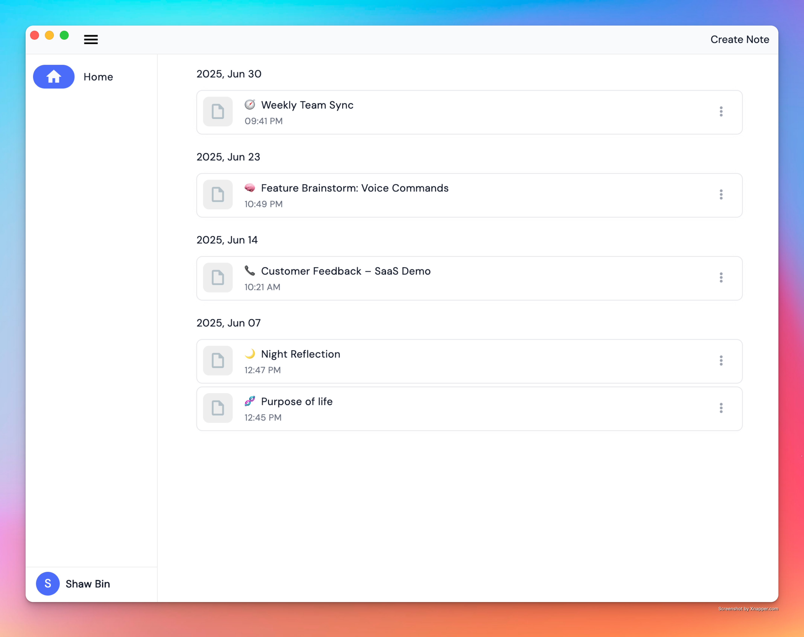
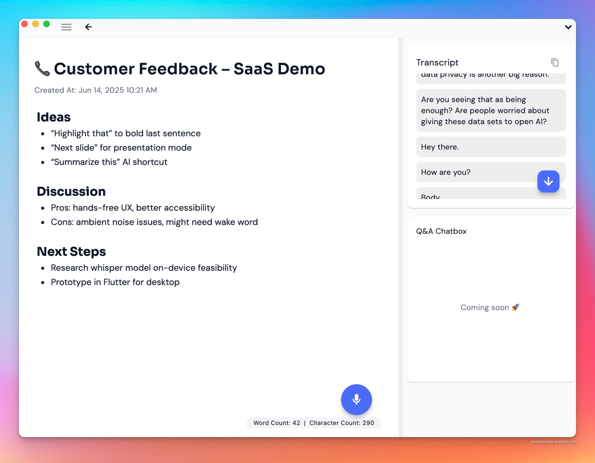

## Screenshots
<!-- image from ./asset -->



# 🧠 AI Meeting Memory

* Record voice, get transcript, ask questions, turn conversation into clear actions - instantly. 
* Advanced features powered by AI. 

## Key Features

- **Live Transcript**
  - Instantly transcribe your voice input into text as you speak.
  - See your words appear in real-time, improving accessibility and ease of note-taking.
  - Supports multiple languages and adapts to various accents for accurate transcription.
- **Rich Text Editor**
  - Edit, format, and organize your transcribed notes with a powerful rich text editor.
  - Add highlights, bullet points, headings, and more for better organization and readability.
- **Chat with Your Notes** (Coming Soon)
  - Interact with your notes using a conversational AI.
  - Ask questions, summarize, or retrieve information from your notes through chat.
- **Smart Tagging** (Coming Soon)
  - Automatically tag and categorize your notes using AI-powered suggestions.
  - Quickly filter and find relevant notes with intelligent tags.

## Getting Started

Clone the repository and run the app using Flutter:

```bash
git clone https://github.com/nsoybean/ai-voice-note-flutter.git
cd ai-voice-note-flutter
flutter pub get
flutter run
```

## Contributing

Contributions are welcome! Please open an issue or submit a pull request for any suggestions or improvements.

## License

This project is licensed under the MIT License.

---

Made with ❤️ using Flutter and AI.
